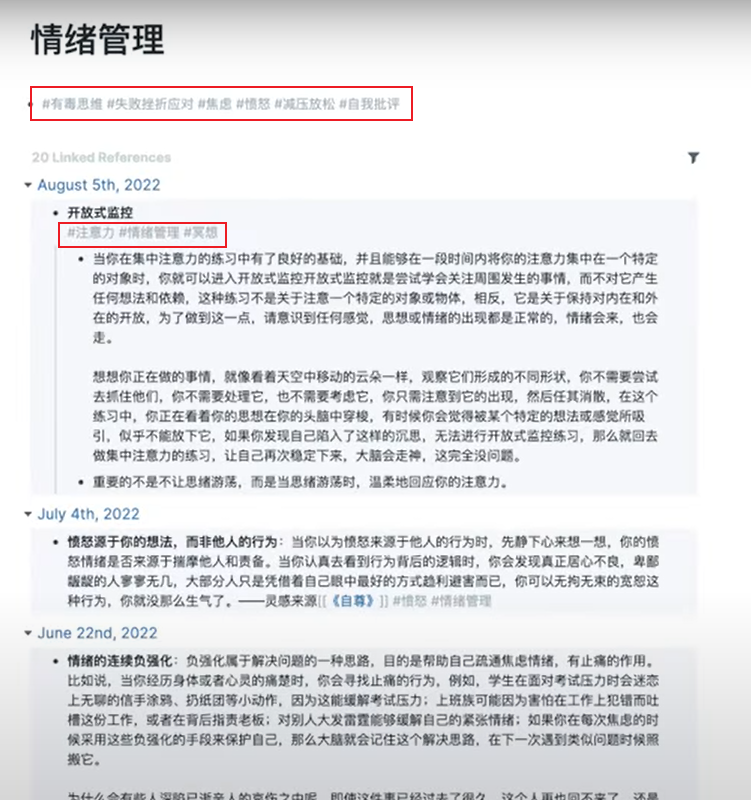

# 学习技巧

## 如何做笔记

第一步：用自己的话表达你学到的东西。

比起摘抄句子，用自己的话输出更好。当你看到打动你的句子时，别顾着抄，它为什么打动你？它讲的是什么？你是否有自己的亲身经历可以举例？思考你自己的上下文，这就是著名的费曼学习法——用自己的话去表达你所学到的东西。如果你讲不清楚，说明你还没有想清楚。

第二步：记闪念笔记

准备一个闪念笔记本，把你的思考写下来。闪念笔记，顾名思义，就是快速的记下你一闪而过的想法的笔记本。你应该记在你随时随地都可以打开的地方。

手机备忘录，录音笔都可以。着急的时候，可以直接在微信中发给自己。记笔记的时间，当我看书产生新灵感时，会立马把它记下来。千万不要等到整本书看完，再去做笔记，因为等到看完书，当时的灵感就不存在了，就想不起来了。

一句话，记笔记要及时。

不要用看起来很漂亮，打开能不方便的工具。

闪电笔记最好围绕一个问题为标题，具体的解决了什么问题。

在写的时候，你可以在心里带着“以后的我能看懂我在说什么吗？”这个问题来写笔记。如果笔记不能为读者服务，至少要为以后的自己服务。

第三步：记卡片笔记

整理你的闪念笔记，梳理成一个个核心观点，把它保存为永久的卡片笔记。

可以把闪念笔记当做思想的草稿，但是卡片笔记，就是已经确定要保存的观点。准备一个双链笔记软件，提取每段话的核心思想作为双链的关键词，把它和曾经的相关的观点绑在一起。关键词不一定需要出现在段落里，也可以自己去总结。

把相关观点链接在一起的好处：

- 有利于系统整理自己的所学。

- 相关观点的碰撞能产生新的思考。

- 有利于激发自己的实践

对于学习，不要急于去否定，而是要去探索。探索别人的反面观点，探索他的上下文，了解他的场景，我们会更懂得他为何这样选择。

第四步：成立话题

当你积累的心得足够多的时候，如果你想更进一步，你可以尝试成立一个话题，把自己的笔记写成文章，这一步并不是必须的。而是根据你对自身的要求来选择。在写文章的时候，不要抱有一次性写好、写不好就放弃的心态，好的文章是改出来的，重复去读你写的东西，他门有哪些逻辑关系，每个段落的主要观点是什么，哪些观点应该在前，哪些观点应该在后。你也可以给每个段落的核心思想起一个小标题，并且把他们按照你认为顺畅的逻辑去排序。在改的时候，同样带着“以后的我能看懂我想要表达的是什么吗？”这个问题在心里不断地审视、不断地调整、直到你觉得你自己能不费精力的通顺的读完。

第五步：寻找反馈

寻找反馈有两个方法：

第一个是把文章发出去，让别人看到，只有得到反馈，我们才能检验自己。或被人赞同，或被人反馈，这都是反馈。如果没有人反馈，说明你写的还不够好，不够清晰，或者发的还不够多，你可以坚持继续写，继续分享。

第二个是通过实践寻找反馈。学到的知识如果用不上，那就是白学。无论学什么，都不可能通过想象来决定它的有效性。最好的办法就是去实践。

## 如何克服分心

容易分心的原因：

- 遇到困难。大脑天生有逃避机制，它喜欢逃避困难，并且它的想象力也很丰富，在遇到挫折的时候，它会放大这件事情的困难程度，觉得根本不可能完成，这会让我们更加焦虑。

  解决方法：不要想太多，降低对预期结果的要求，直接开干。不要追求完美，先把脑子里想到的，能写的先写下来，写完后再改就是了。另外，尝试通过问问题了解自己，比如：是不是哪里出了问题？是不是某些例子不合适？是不是某些论点还未求证？可以采区任务拆解法，拆分任务。当把一个大困难拆解成几个小任务以后，一次只专注于一个小任务。大脑就觉得没那么难了。更容易专注。

- 脑子里装太多事。没有把心思完全放在目前这件事上，总是会想着接下来做什么。一旦有这个心态，就会很难专注。这是因为信息会占用我们的注意力资源，拖累我们处理其他事情的速度。这时候就需要建立自己的外脑系统，把想要做的事情，烦恼，灵感记录下来，让大脑做最擅长的事，把记忆的任务留给电脑。

  解决方案：推荐工具Taskade

- 一心多用使我分心。我们总以为自己在同时处理多任务，但事实上，我们只是在多件事情中快速的转移自己的注意力，而每一次转移注意力都会削弱我们的专注力，并且延长我们再一次集中注意力的时间。千万不要一起做同时需要用脑的事情。

- 工作流被打断。在做专注类的工作时，各种突如其来的打断都可能导致分心，而且很难再次专注。

  解决方案：统一留时间一起处理。

- 缺乏新鲜感。感到无聊，人容易对熟悉的事情感到无聊，多巴胺分泌不足时，人就会变得迟钝，消沉。人是需要新鲜感的，人类的愉悦感原来与多巴胺有关，但多巴胺消失的很快，所以达成目标所带来的快乐不会持续太久，成就感总是飞逝而去。人们很难从中体会到太多的满足感，这就需要我们不断的折腾，寻求挑战，来满足自己的原因。

  解决方法：尽量不让自己陷入一个枯燥的循环当中，在多巴胺流失之前先给他补上。允许自己娱乐，运行自己放松。

## 如何多样化学习，看书还是碎片化知识？

从书本上看的不一定就是体系化的知识，同样从公众号网络看到的也不一定就是碎片化知识。核心的在于，当这些信息进入大脑，是以什么样的形式被你编码和存储的，如果你孤立的、碎片的去记忆他们，那就是碎片化的。反之，如果你能把它们串联成一个体系，彼此之间建立联系，让知识连成一张网，那就是体系化的。

关键是你的大脑的消化方式是体系化还是碎片化。

“凡是值得思考的事情，没有不是被人思考过的。我们必须做的只是视图重新加以思考而已。”

专注力不足时看视频，专注力充足时看书。

睡前饭后看公众号。

感到枯燥时，可以放松一下，看电影、演讲，不必强迫自己时时紧绷，只学干货，也可以看看其他的东西。

学习结合实践效果更佳。

## 自下而上的学习

观点来自于《卡片笔记写作法》

自上而下：先框架后学习，先找主题再找资料。

自下而上：先学习后框架

1. 不强迫自己学习，不给自己设限，让兴趣引导行动。看书只看自己感兴趣的书，不强迫自己学习，不强迫写作，写不出来，学习不下去，就去做其他事情。持续学习应该是开放式的，因为思考和洞见本来就是无法预知的，如何能通过计划规定出来呢。
2. 为学而写，把学到的东西写下来，并思考它们之间的联系。为了在学习的时候捋清思绪，把学到的东西写下来，检查自己的思路，不写作就无法思考。连续看好几本书也一无所获，把自己限定在了并不实际的框架之内，这个框架是自己想象的框架。
3. 整理你写过的东西，给他们梳理框架。

光靠意志力坚持的行动不可持续发展。我们应该自下而上的发展，让兴趣引导我们行动，更轻松的努力。

## 记忆力小知识

1. 理解是基础。揣摩背后的原理，为什么是这样。
2. 运用费曼学习法。把自己学到的通过语言讲出来，能够让别人听懂。讲给自己听，讲给别人听，核心就是用自己的话进行输出。
3. 结合兴趣与内容建立联系。如果对自己的学习材料，自己学的知识索然无味，即使花再多时间也难以记住。有时候我们无法选择要背诵的内容，但我们可以尝试把需要记忆的东西想的有意思一点。把它们结合自己的兴趣一起记，效果会更好。
4. 让记忆和生活产生关联。例如背单词先背自己常用的。
5. 掌握大脑记忆规律，温故知新，重复记忆。四个记忆周期：瞬时记忆=》短期记忆=》长期记忆=》永久记忆（艾宾浩斯遗忘曲线）
6. 尽量在无干扰的环境下背诵
7. 掌握记忆时间，睡前回忆。每次睡前（午休和晚睡）和睡醒后都回顾一遍。
8. 视听结合。同时利用听觉和视觉的功能来强化记忆，能提高记忆效率，要边读边记，避免默读。
9. 学会保养你的大脑，科学记忆。多吃延缓认知能力下降的食物，如蓝莓
10. 间隔学习法，并不是要连续不断地学习，应该经常性的短暂休息，无论你在学习什么。为了获得更好的结果，间隔休息是很重要的。在长时间学习或工作一段时间后，休息一会。连续学习45分钟后，休息十分钟。

## 提升专注力

1. 找到你的心流，是什么让你废寝忘食。你是否曾经感受过完全沉浸在一项活动中，以至于丧失了时间感。有可能是在打游戏、看电影、看书中体会到的。心理学家将这种感觉定义为心流。研究表明，经历心流体验的人，能够表现出更高水平的创造力、生产力和幸福感。大脑只要做它喜欢的工作，就不会感到疲倦。不仅如此，大脑还会为了更好的完成自己喜欢的工作而不断发展变化。总之，只要坚持做你喜欢的事情，大脑就会自动的产生与之相应的进步。在脑海里形成更适合你学习的环境。
2. 如何保护你的专注力。
   - 把相似的事情放在一起做。“多任务处理使我们分心，如果我们能避免处理多任务，尽可能将不同类型的任务分开，使他们之间不会相互干扰。我们就能训练自己在更长时间专注于一件事的能力。
   - 定时清空你的大脑。不要过于相信你的记忆力，信息回占用我们的注意力资源，直到被遗忘。要把想要做的事情记下来。当这么做了之后，脑子里就不用装那么多的东西。你会发现一切都变得轻松了很多。
   - 灵活分配你的注意力。集中注意力和漂浮注意力，根据任务和需求灵活的分配注意力，更聪明的分配自己的注意力。例如：看书就是一件灵活分配自己注意力的事情，有些书值得一读再读，有些书只适合略读。如果只运用一套方法来读，那就太荒谬了。正确的方式是根据实际情况调整阅读的速度和方法，没有一个工具能解决任何问题。所以，如果能掌握灵活分配注意力，将会在不重要的事情前学会节省自己的注意力。把专注力用在更重要的事情上。

## 如何提升读书效率？

培养阅读兴趣。

1. 不喜欢看不懂的书不要读。不是每一本书都值得看，也不是每一本书都适合自己。有些书虽然是好书，但是你现在看不懂，懂了也没有用。比如有些哲学书籍，虽然是好书，但是真的读不懂。经历和见识都没有达到和作者能够产生共鸣的程度。这种就可以留着以后再看。我们的认知会随着学习的提升和经验的增长而改变。也许以后经历的更多了，就看的懂了。先选择自己感兴趣的，自己想读的书。把读书当做和其他爱好一样简单的活动。都是为了打开对世界的好奇，接触新鲜信息，提升认知，没有必要思想负担太重。看到不喜欢或者对自己没用的书，不要强迫自己读完。改变这个习惯后，会发现能看到更多的书，学到的东西也更多。注意：这个技巧不适用于考试，如果是考试，再不喜欢也得看。
2. 用手指指着读。再看东西的时候，我们的目光是跳跃的、发散的，而用手引导，会使我们的阅读更舒服更轻松和更高效。有利于集中我们的目光和注意力。所以在阅读的时候，可以尝试用手指有节奏的一行沿着一行指引，可以锁定我们的注意力。如果你的手指在书中倾斜着沿着多行的运动轨迹指引，还可以一目十行。这个技巧很适合用来找资料。当你需要从大段的文字里，找到你需要的信息时，你没有那么多的精力一个一个的去看，这时候最好的办法是扫描。如果想快速的，一次看到更多的信息，那么使用更大的屏幕阅读比小屏幕更有优势。用平板、电脑阅读，比手机效率更高。
3. 边读边看。在阅读的时候朗读，同样有助于提升我们的注意力，不需要很大声，只需要轻声的读出来，让自己能听见，就足以引导我们的注意力回到书上。因为我们看书的时候，大脑会走神，它并不是每时每刻都聚焦在文字上的，这也是为什么有些人觉得读书很吃力的原因。其实不是读书吃力，而是我们在聚焦我们自己的注意力的时候感到吃力。但是，当我们看视频或者听书的时候却没有这种烦恼，我们更喜欢通过声音或具象的画面来接触信讯息，这使我们的注意力更轻松的聚焦起来。所以，当你感觉有点无法专注，看不进书的时候，可以尝试念出来。你就会发现你更能读下去。
4. 不需要一字一句读完。当一直在研究同一个领域，读某一个领域的书足够多的时候，你就会发现很多书的内容都是一样的， 道理也是一样的，甚至有时候举得例子都差不多，只是换了个说法而已，这时候就没有必要一字一句的读完了。
5. 不需要做很多的笔记。不需要去摘抄章节标题、或者标注书里的话，因为这些书里都有啊。我们摘抄笔记很大的一个原因是，我们觉得抄下来，我们就会记住它，但实际抄下来的，大多数还是记不住。能记住的，都是那些经历过实践过的道理。最有用的读书方法是把书里的道理吃透了。运用在自己的生活或工作里，我们大脑只会记住那些对自己有用的信息。要以读和输出为主，做笔记为辅。第一，看完一本书后结合自己的经历，用自己的话叙述学到的道理，遇到有共鸣的地方，尝试写写我产生共鸣的个人经历是什么，尝试描述自己的故事。第二，把学到的道理运用到实际的生活或工作当中去，去检验它的可行性，然后写总结。第三，用自己的话描述整本书的框架，可以不按照目录，只按照自己的逻辑，去描述它整体讲了什么。不是把知识抄下来，它就会成为你的知识。
6. 教别人你所知道的。当一个人向别人解释或者教授某个概念时，他们能够记住学到的大约90%的东西，教别人你所知道的，是学习记忆新知识最有效的方法之一。心理学家称之为回忆练习。通过教授别人，你可以快速的找出你知识当中的漏洞（费曼学习法）。对知识最终的考验，就是你把知识传达给另外一个人身上的能力。因此学习吸收和记住新知识，最好的方法是学习加分享。例如与其一口气看完一本书，什么都不做，不如看完之后，尝试回忆分享，教授别人你所学到的，更能巩固知识。

## 如何缓解焦虑克服分心？

你可能会感到焦虑、伤心或失望，请意识到，情绪会来也会走，你一定会好起来的。想想你正在经历的难熬的情绪，就像看着天空中移动的云朵一样，观察他们形成的不同形状，不需要尝试去抓住它们，也不需要处理它，只需要注意到它的出现，然后任其消散。在这个练习中，你正在看着你的想法在你的头脑中穿梭，重要的不是不让思绪游荡，而是当思绪游荡时，温柔的注意到它。

从小事做起，如果你感觉这段时间很疲惫，没有动力，好像一切都很难，很想努力，但不知道该如何重新开始，那么就学会放松自己。从小事做起，从你认为合理的目标开始，先尝试把它减半，目标可以很简单，先坚持一个月，奖励自己实现了目标。然后再左键增加练习难度。

## 如何缓解压力？

以为随心所欲的放纵自己，就是在弥补自己，比如报复性熬夜，暴饮暴食，不加节制的买东西等等，这类事情，在做的过程中，可能会暂时忘记自己的烦恼，但对未来的自己却造成困扰，比如说，得到一个更大疲惫的身体，更干瘪的钱包，这些都是无效放松。有效放松意味着你能够通过接纳自己，了解自己，并尝试一些对身心健康有益的活动，得到更加积极正面的影响。它跟无效放松的区别在于，对于未来自己的影响。

当学习工作时，精力透支以后，怎样缓解压力：

1. 客观的看待自己，不要加标签。在你感觉不好的时候，观察自己，温柔的询问自己的感受，哪里出了问题，不管答案是什么，学会接受自己。学会在自己面前表达自己的感受，在观察自己的同时，千万不要给自己加标签，不要过于严苛导致偏离事实。应该用客观的眼光看待自己，比如说有些人，在事情没有按照预期中发展时，会对自己说废物，而接纳自己的人会说，一天背100个单词确实太难了，我承认这让我很难坚持下去，不要夸大事实，不要用主观的形容词来描写自己。比如说，废物，我很没用等等。语言是有魔力的东西，它的魔力在于长期用一些尖酸刻薄的话来形容我们自己，我们就真的会这样想。语言会影响我们的思想，潜移默化我们的认知。也就是说，当你形容自己是废物的时候，你就可能真的这样看待自己。这种心态导致的后果就是失去行动力，焦虑、沮丧。失去对生活的热情，并且会因此产生恶性循环。觉得自己一无是处，什么都不想做。认为生活没有意义，又因为觉得生活没有意义，更加什么都不想去尝试。不要给自己贴标签，也不要给别人贴标签。当你在生活中学会管理好你的语言。不随便主观评判任何事物的时候，你也能保持更加正向和积极乐观的心态。
2. 接纳自己暂时的停滞，抛弃完美主义的野心。如果在这个状态下，你感觉自己什么都不想做，那就什么都不做，请允许自己暂时的放空。有时候，我们会过于执着的要一个结果，而忘记了努力的本质是过程，比如说，我刚开始学习英语那会儿，就想要马上学会，刚开始准备高项的时候，就想一次性全部背完，是这种急于求成，追求完美的心态使我疲惫，没人能一口吃个胖子，只需要专注当下就好了，不管我们期待的未来多么宏大，我们都要把现在过好才能实现它。我们要从过程中学习，不止从结果中学习。不要想着一次性把所有的事情都做完，做好，我们是每天做一点点，日积月累就做了很多事，暂时休息、暂时停下来，并不可耻。况且，意志力是有限的资源，如果用力过猛就会耗尽，而且需要很长的时间恢复。
3. 要有自己的兴趣爱好。一定要有兴趣爱好，在放松的状态下最能发挥创造力。
4. 适当的社交。孤独会失去对事物的感知能力。孤独感不仅仅影响心理状态，甚至对生理健康也有害，甚至能诱发死亡。非自愿孤独会加深患心脑血管疾病的概率，甚至导致过早的死亡，原因是当人被动的感到孤独时，人们的身体会分泌应激激素，这类激素会对人们的身体造成伤害，在这种非自愿孤独的状态下，孤身一人，人们感受到的痛苦比有他人陪伴时大得多。人类是群居动物，需要通过社交来吸取养分。
5. 适当做白日梦，让思绪自由流淌。可以尝试不带任何目的的写点东西，随便怎么写，反正写给自己看的，写的怎么样都无所谓。把你的胡思乱想倒出来，等于在给大脑做放松按摩。可以漫无目的的散步，带上耳机在公园里走走。边听音乐，边放空自己活着任自己胡思乱想。“人们需要让自己当下的想法无拘无束的释放”，这个心态和完成许多任务需要的心态截然不同，完成许多任务需要的心态截然不同，完成任务需要以结果为导向，进行有意识的思考。而自由自在的做白日梦甚至有益于人们的表现和创造力，因为它不以结果为导向。
6. 互补休息法。

## 自律的秘密

自律和动机最大的区别在于，动机关注的是你的感受，是从你出发，你心里想的是“我想不想做”，而自律关注的是你的系统，不是你的感受，所谓系统，就是你一旦按下了执行开关，它就会按照既定的算法去执行。不管我想不想做，我只是去做。

不清楚自律当中的角色：自律的目标是为了生活在你自己设计的生活里，因为我们想成为更好的自己，我们想追逐更好的生活。因此我们需要去坚持做一些事情来达到我们的目标。在这个事情里，一共有两个角色。第一个角色是设计者，它设计了你的目标，以及达到你的目标需要做哪些事情，需要坚持哪些习惯。第二个角色是执行者，一旦设计好了，就按部就班去执行。不要想太多，干就完了。而很多人的做法是，在没有搞清楚目标时就盲目执行，在执行时，又反过来怀疑自己的目标。比如说，我这样做有意义吗？我这样做有结果吗？坚持自律那么痛苦，我为什么要自律啊，那是因为你从头到尾都没有搞清楚自己自律的目标是什么，你的动力来源在哪里？有些习惯，你只是想起来就去做，没有想起来就不做，你想做就做，不想做就不做，这不是自律，这是即兴发挥。

自律的人并不是天生就自律。没有人不适合自律。每一个自律的人都经受了一定的痛苦，他们只是磨砺了自己的韧性。就像我们去健身培养自己的肌肉一样。你只有每天突破一点点，你才能拥有结实的肌肉。如果你连一点点挫折和枯燥都忍受不了，这不是你不行，而是你的情绪肌肉太弱了。

锻炼自律的方法：

1. 多做一些让自己不舒服的事，刻意去培养自己的情绪肌肉。自律是可以被培养的，我们的大脑是很懒的，它会去追逐舒适，刻意去规避一些不舒适的事情。阅读这个活动本身就是在训练我们忍受无聊和痛苦的一个过程。当你做这样的事情越来越多，你的忍耐力就会上升，面对挫折的能力就会上升，你的自律力就提高了。和吃辣椒有点类似，越吃就变得越能吃辣。如果你想变得自律，就要刻意去培养自己面对枯燥、无聊和挫折的毅力。因为自律从整体上来说是需要毅力的。而毅力是做成很多事情的底层能力。虽然说有很多技巧都可以帮我们提升自律，但是如果你没有毅力，一切都免谈。

2. 抛弃完美主义。不要想结果，干就完了。完美主义是你变得更好路上的最大绊脚石。完美主义不仅会导致拖延，也会导致焦虑。

3. 设立习惯公式。只要做了“A”，我就做“B”。如果觉得很难记住你的新习惯，可以尝试在你经常做的事情后面去增加新的习惯。比如说，只要洗了澡我就看书，只要起了床我就背单词。只要吃了饭我就听听力等。给自己设定一个触发事件，一旦做了某事，就开始做另外一件事情。借此来提高自己的行动力。

4. 习惯公式：在某某时间在某某地点做某某事。有了行动的想法，去没有具体的执行方案，比如说，你想学英语，但是你却不知道怎么开始。这个不知道就成为了你行动的阻力。你就会容易给自己找借口。我现在还没有准备好，我现在没有时间，现在不是最好的时机。其实你缺的不是一个时机，而是一个具体的执行方案，你可以尝试这个公式。比如在每天8点在地铁上背10个单词。

5. 从小事做起。不要给自己设立宏大的目标。可以设立小目标，一点点增加。在坚持一个习惯的初期，你需要的不是挑战，而是成就。

6. 学会拆分任务。通常我们想要拖延，还会因为我们遇到了一件比较复杂的事情，一时之间乱了头绪，一想到这件事情就觉得很混乱。很麻烦不想开始。比如说即将到来的重要的工作汇报，重要的项目方案等等。你知道他很紧急，你也知道你必须要去做，但就是不想做，越拖延越焦虑，越焦虑越拖延。如果你是这样的，可以尝试下这个方法。

   ①先把关于这件事情的所有环节写出来。不要去管逻辑，不要去管顺序，一股脑全部写出来。这么做的目的是让你把大脑里的混沌快速的倒出来。

   ②给它们排序。第一步做什么，第二步做什么，第三步做什么

   ③执行。可以把一个大的事情给自己拆分任务。

7. 学会奖励自己。 坚持一个月的健身，就买下喜欢的运动装备奖励自己一下。让自己在努力的路上有点盼头，毕竟，坚持自律的目的，不就是为了让自己过上更好的生活嘛。不要一直努力而忘了奖励自己。

8. 改善环境。自律能力较差的人，建议从环境开始改变，给自己一个干净的书桌，有自己的学习空间。把手机放在看不见的地方，给自己整一个明亮的台灯。人是很容易被环境影响的，如果你在宿舍，你的室友都在打游戏，熬夜，而你喜欢读书。可能过不了一个月你也会开始打游戏或者根本没有心思看书。如果你改变不了你的环境，可以去图书馆或者自习室学习。其实很多人选择图书馆学习，原因也是一样的。因为那里有一群同类人。

9. 把自己想象成你想成为的人。比如健身，每次开始健身都让你非常的痛苦，想要拖延，不如把自己想象成理想当中的运动偶像。他的行为习惯是怎么样的，他是怎么样去坚持锻炼的。可能锻炼是他每天的日常。这样想呢之后，就有可能驱动你也像他那样去坚持。如果你喜欢写作，那么你可以把自己想象成自己喜欢的作家。他是怎么样学习的，他是怎么样坚持他的写作习惯的。带着作家思维去练习，你更有可能成功。

## 学习习惯

超级学习：指的是那些没有什么天赋、平平无奇的普通人，通过改善习惯，刻意练习的方式，在事业和学业上获得了不错的成就。

1. 超级学习者阅读量大。当我们在阅读的时候，你所有的成长、见识、理解力都会在这个过程中发生改变。一个超级学习者，他的阅读量一定是很大的。读书时一个改善生活、观点和事业的机会。
2. 超级学习者把学习视为一个过程。学习是一个不断获取新知识的旅程，而不是终点。只为过程，不为结果，因为已经将学习视为一个终身的事业。超级学习者，他们并不急于求成，也不会因为遇到困难就轻易的放弃。他们能理解对任何事情的掌握需要的不仅是敏锐的洞察力，更需要的是持续的耐心和好奇心。学习是一种投资，它通常能够从你上涨的收入当中获得回报。所以他们很重视这个过程，他们没有最终的目标。他们寻求的是持续的成长，不断地获取新知识，观点，思维模型等等。他们对学习具有持续的自我激励式的追求。
3. 超级学习者会教别人他们所知道的。当你在向别人解释或者是教授某个观点的时候，你能够记住你学到的大概90%的东西。教别人你所知道的是学习和记住新信息最有效的办法之一。心理学家称之为回忆练习。当你在教授别人的时候，你能够快速的找到你知识当中的漏洞（费曼学习法）
4. 超级学习者关心他们的大脑。一个经常用脑的人一定要学会去保养自己的大脑。你对你的大脑做什么或者不做什么是会显著的影响到你的记忆力和敏锐能力的，可以去吃一些延缓认知能力下降的食物。
5. 超级学习者采用间隔学习法。应该经常性的短暂的休息，不管你在学什么，如果你想让你的学习更高效的话，那么间隔休息是很重要的。因为我们的大脑的神经网络需要时间去处理信息。所以间隔学习法更加有助于去记住信息。让我们自己的大脑有时间去恢复。
6. 超级学习者制定计划。首先你要学会制定合理的可执行的计划。然后流出足够的固定的时间来学习，让你的学习形成习惯。比如想要学习一个新知识，要先去了解他的整体知识框架，他要讲些什么，然后结合自己需要什么，最后才会决定第一步学什么，第二步学什么，第三步学什么，并不会从头到尾的去学下来，学习这个东西，你应该要有自己的计划。
7. 超级学习者培养自己的专注力。可以通过看书、写作、冥想等等，需要静下心来的活动去培养自己的专注力。长久的有效的注意力是学习的基石。
8. 超级学习者制定有针对性的学习目标。我们不仅要学会去制定计划，更要学会去设立目标，带着目标去学习，你的学习会更有效率。计划是旅程，目标是节点。每一次达成你的小目标都意味着你在某个阶段的小成功。也意味着你在某个阶段需要聚焦的事情。为什么制定了计划却执行不了，很大的原因是你没有清晰可达成的目标。比如你想学英语，那你这个月的词汇量是多少？这个目标设计的合理吗？你能达成的几率有多少？达成之后有没有奖励？如果你的目标都没有给你可达成和激励的感觉，那么你是没有动力去做这件事情的。太过模糊或者是太过宏大的目标都会削弱我们的行动力。
9. 超级学习者测验，回想学过的知识。很多人看视频学习和看书学习，看完之后觉得会了，但是做的时候发现并不会，这是因为看这个动作是在被动的输入。而测试是主动的学习。测试是学习当中最重要的一环，学完某个知识点后，可以通过测试实际应用和自己问自己问题的方式去验证自己到底掌握了多少。
10. 超级学习者懂得收集反馈。尽可能的向身边专业的人或者是身边的人寻求反馈意见来指导你的学习，虽然并不是每个人的反馈意见你都要听，但是学会去聆听反馈是能够快速提升你的学习成果。快速的找到你学习当中的弱点的最高效的方法之一。这个方法特别适合那种过程性的活动。比如说演讲、表演之类的。

## 学到的知识用不上？

学到了知识用不上？不知道怎样结合实践，看了很多书，但是对生活没有实质性的改变。如何更好的内化所学的知识？

1. 为解决实际问题而学习。读书并不能帮我们解决问题，读书是在帮助我们提供解决问题的思路而已。真正要解决的问题，还得通过自己的行动。

2. 实践是检验知识的最佳手段。学习的目的是通过了解别人的思想，来指导自己的行动，学习的终极闭环就是行动，而不是囤积信息。不轻信任何一种知识，而是争取自己先尝试，先实践。再总结修改属于自己的方法论。

3. 费曼学习法：以教为学。例如与其一口气看完一本书，什么都不做，不如看完之后，尝试回忆分享，教授别人你所学到的，更能巩固知识。

4. 建立自己的思维工具箱。在遇到问题的时候思考总结，这是一个什么类型的问题。有什么样得解决思路，如何去保存这个思路。这就是思维模型的一个简单特征。当他们遇到的问题越多，他们积累的思路也越多。因为他们很好的把自己的思路保存了下来，因此在他们遇到类似的问题时候，他们不慌不忙，临危不惧，掏出解决思路。这个不慌不忙的表现让我们感觉很聪明，好像他们总有锦囊妙计。这个世界上没有绝对的聪明人和笨人，只有懒人。可以通过练习，变得比从前的自己更聪明一些。建立自己的思维工具箱，需要实践加记录，它不仅是从看书中获得，当然也可以从实际生活中获得。想想你生活中解决了哪些难题，你有认真分析过自己是怎么样解决的吗？思路是什么？比如说客户和你发生了争吵，你是怎样应对的，从哪些角度去说服对方的，步骤是什么。或者有哪位同事应对的比较好，他是怎么样应对的，你学到了什么。在年底项目超级多而又时间不够的情况下，你是怎样去平衡优先级的。怎么样去协调自己的时间，别人是怎么样做的。把这些思路记下了，思考它们能不能用在别的场景下。如果你没有思路，你也可以去找相关的书来读。或者观察身边优秀的同事和领导是怎么样处理的。学习别人的智慧，把别人的智慧运用到自己的实际生活中去，这才是学习的意义。你最好有一个特定的地方去记录，并且给它们去分类，当你遇到类似的问题的时候，可以去翻开这个笔记本，看看曾经有没有类似的思路，需不需要补充或者更新。通过这样的积累，一步一步的去丰富你解决问题的思维工具箱。当你积累的足够多，回顾的足够多的时候，你的大脑就会下意识的运用这个处理思路。在碰到类似的问题时，你就能表现的游刃有余。

5. 摆正学习心态，创造良性循环。学习是一个不断发现新知识的旅程，而不是目的地。学习是一种投资，他不会马上见效。但一定会在未来的某一天给你更大的回报。学习带来的益处是长远的，但是要获得这些回报需要我们真正的提升自己，而不仅仅是有信息储备而已，这也是我践行终身学习的动力。

   成长型思维：成长型思维的学习者，关注的是内在的成长，是我做这件事情我有没有尽力，我满不满意，我有没有从中获得提升和成就感，他的激励来源于我对做的这件事情的本身的反馈。

   固定型思维：固定型思维的学习者，更关注外界是怎么样看待我的。我能获得什么样的夸奖，我会得到什么样的奖励。他们更关注的是我自己是什么，而不是我做了什么。

   成长型思维的人从提升自我的过程中获得激励，固定型思维的人从外在的赞美中获得激励。他们的区别在于一个是内部驱动，一个是外部驱动。研究表明，被内部成长驱动的人会拥有更加持久的学习动力。

## 逻辑清晰技巧

1. 选择困难症：打分法。推荐工具：Scrintal（思维地图工具）。
   - 第一步：写下所有可行性选择
   - 第二步：写下你的评估条件
   - 第三步：计算每个选择的总分值
2. 写文章如何理清逻辑：逻辑梳理模板
   - 时间关系
   - 因果关系：先发生了什么导致发生了什么，重点在于只有发生了A才发生B，
   - 大小关系（从宏观到微观）
3. 做笔记：提前归纳法

## 关于自学

找到资料后，不用按照作者的内容框架从头到尾学习，有时候并不需要一下子学那么多，因为有些知识用不上，学了也会忘记，浪费时间，所以一切围绕你现在想知道的重点去发展，一定要有自己的主线，需要什么就学什么，不要多学。

根据自己的时间来划分任务。不要一下子给自己规定太多的学习任务，因为自己根本没有那么多的时间去完成。摸清自己的节奏，这对分配任务很重要。

时间规划=》学习计划。

学习时，提前10分钟准备，进入专注状态。

反馈优化。

## 关于写作

为什么要写作？

心理学上有一种疗法叫“书写疗法”。

书写疗法：是一种通过写作来帮助个人表达和处理情感，以改善心理健康的心理治疗方法。通过书写感受和经历，它有助于减轻压力，提高自我理解，改善情绪，以及增强解决问题的能力。

就是把不透光的情绪写出来放在纸上，当这些被你遮盖的阴影，落在纸面上时，你内心淤积的负面情绪就可以流动起来，最终流出你的体内。

为什么写作这么难？每个想要写作，却又迟迟不敢开始的人，都是因为自我否定。无法认可自己没有价值的想法，抱着写出来的内容必须达到一定的水准才可以的心态，标准过高导致我们迟迟不敢动笔。

写作不是必须要条条框框，能够遵循自己的内心一直写下去才是最重要的。

不用非得列大纲再填充内容，这种方法虽然能够具有写作方向，但是一旦陷入完美主义的时候，反而会限制行动。如果内心不自由，则作品不自由。如果你写作时感到不快乐，则你写出来的东西就没办法让别人感到快乐。

每一次写作前，都告诉自己，我有写出烂文章的自由，你只需要完全的释放自己，不要求任何标准，什么标点符号，起承转合，吸睛金句，通通都丢掉，写作是你的原始森林，当你释放你的能量后，再开始修剪你的花园也不迟。

写作只有一个规则，那就是持续不断地练习，不可荒废，不要说我的写作要等到下周，下个月，下半年，就是现在，不管你脑中在想什么，把它写下来。别视图控制你的大脑和手，只管记录你心中涌现的声音，坚守在这一刻。当我们写作时，我们应该为自己而活，我们的日常工作，大多数都是为了迎合别人的标准而行动，只有写作是你的王国。面对空白的纸张，哪怕鬼画符也好，都完全按你想的来做，你的写作是最不需要谄媚别人的一件事，不要为了猜测别人的喜好而去写作。要写你真正的想法，然后吸引与你想法相似的人。

可以使用Scrintal工具先打草稿。

写作时，手机直接超级省电模式。不要自己被干扰。时间只属于自己，内在的自己，不仅要让外界的通知闭嘴，把内在的噪音也关掉，什么你写的不好呀，你写的别人不感兴趣呀这些，通通都丢掉。把你的自我丢掉，只剩下一颗想要叙述的心，只描述你脑中涌现的景象，而不去想它对不对。

其实写作就是倾诉，每个人都有自己的生活素材，没有人没东西可讲，我们只是害怕自己讲的东西别人不感兴趣罢了。如果你肯放下这种恐惧，你就会发现，你可以写任何东西。

快乐写作的最后一个条件就是放轻松。

保友金豪b 人体工学椅

建立一个碎片知识区

输出区

写东西是给自己看的，无所谓写的怎么样，只要自己能看懂就行。